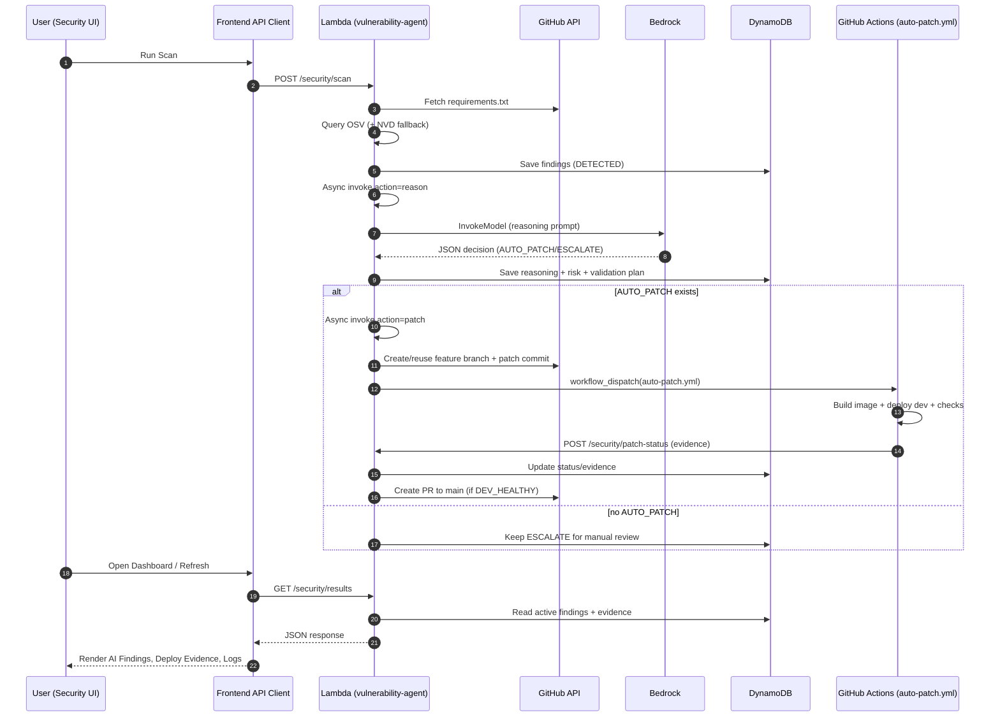

# AWS-ETE-Project (DevSecOps AI POC)

This project demonstrates an AI-assisted vulnerability remediation workflow for Python services.
The main focus is the **security scan -> AI reasoning -> auto-patch evidence** flow.

## Quick Visual Flow (ASCII)

```text
┌──────────────┐
│   User / UI  │
│ Security Tab │
└──────┬───────┘
       │ POST /security/scan
       ▼
┌──────────────────────────────┐
│ Lambda: vulnerability-agent  │
│  Phase 1: scan               │
└──────┬───────────────────────┘
       │ read requirements.txt from repo
       │ query OSV (+ NVD severity fallback)
       │ save findings in DynamoDB
       │ async self invoke: action=reason
       ▼
┌──────────────────────────────┐
│ Lambda: Phase 2 reasoning    │
│ Bedrock (Nova Micro)         │
│ decision: AUTO_PATCH/ESCALATE│
└──────┬───────────────────────┘
       │ update findings in DynamoDB
       │ if AUTO_PATCH -> action=patch
       ▼
┌──────────────────────────────┐
│ Lambda: Phase 3 patch        │
│ create/reuse feature branch  │
│ trigger GitHub auto-patch WF │
└──────┬───────────────────────┘
       │
       ▼
┌──────────────────────────────┐
│ GitHub Actions auto-patch.yml│
│ build image -> deploy dev    │
│ health + validation evidence │
└──────┬───────────────────────┘
       │ callback: /security/patch-status
       ▼
┌──────────────────────────────┐
│ Lambda updates status/evidence│
│ create PR if dev healthy      │
└──────┬───────────────────────┘
       │
       ▼
┌──────────────────────────────┐
│ UI Dashboard                 │
│ AI reasoning + evidence tabs │
│ approve for prod             │
└──────────────────────────────┘
```

## What This Project Does (Short)

- Scans service `requirements.txt` files for known vulnerabilities.
- Enriches vulnerability data with severity and advisory context.
- Uses AI to decide whether each finding is `AUTO_PATCH` or `ESCALATE`.
- For auto-patchable items, creates a feature branch, deploys to dev, and collects evidence.
- Shows findings, reasoning, and deployment/validation evidence in the Security Dashboard UI.

## Security Flow (End-to-End)

1. User triggers scan from UI (`/security/scan`).
2. Scanner fetches package versions from GitHub repo files.
3. Scanner checks advisories via OSV, with NVD fallback for severity.
4. Results are saved in DynamoDB (`DETECTED` state).
5. Lambda auto-chains reasoning step (`/security/reason`).
6. AI reasoner decides `AUTO_PATCH` / `ESCALATE` with confidence + risk context.
7. If auto-patch exists, Lambda auto-chains patch step (`/security/patch`).
8. Workflow builds/deploys patch branch to dev and sends evidence callback.
9. UI shows evidence, status timeline, and approval state for production.

## AI Workflow (How It Works)

### 1) Input to AI

For each vulnerability, the reasoner builds context like:

- package name
- current vs safe version
- severity
- CVE/advisory summary
- affected service
- version delta (patch/minor/major)

### 2) AI Endpoint

The system calls **Amazon Bedrock Runtime** from Lambda (`boto3`):

- endpoint: `bedrock-runtime:InvokeModel`
- default model: `amazon.nova-micro-v1:0`

### 3) Bedrock Payload Example (sent by Lambda)

```json
{
  "messages": [
    {
      "role": "user",
      "content": [
        {
          "text": "You are a senior DevSecOps engineer... (vulnerability context + output schema)"
        }
      ]
    }
  ],
  "inferenceConfig": {
    "maxTokens": 512,
    "temperature": 0.1
  }
}
```

### 4) Expected AI Response Shape

The prompt forces structured JSON output:

```json
{
  "decision": "AUTO_PATCH",
  "reasoning": "Minor upgrade, low break risk for this service.",
  "confidence": 85,
  "risk_score": 6,
  "breaking_changes": false,
  "changelog_risk": "MEDIUM",
  "changelog_summary": "Minor version upgrade requires compatibility checks",
  "validation_plan": [
    "Confirm service health endpoint after deployment",
    "Check startup logs for new warnings/errors"
  ],
  "risk_explanation": "Service is internet-facing but exploit path appears constrained"
}
```

### 5) Important Clarification

This project currently uses **hosted model inference** (Bedrock endpoint calls), not custom model training/fine-tuning.

## API Examples

### Trigger scan

```http
POST /security/scan
Content-Type: application/json

{
  "services": {
    "bff": "backend-services/bff/requirements.txt"
  }
}
```

### Trigger reasoning for a scan

```http
POST /security/reason
Content-Type: application/json

{
  "scan_id": "SCAN#2026-05-24#d5f327bd"
}
```

## What Viewers Should Focus On

When reviewing this repo/demo, focus on:

- `agents/vulnerability-agent/scanner.py`
- `agents/vulnerability-agent/reasoner.py`
- `agents/vulnerability-agent/handler.py`
- `.github/workflows/auto-patch.yml`
- `frontend/src/pages/SecurityDashboard.jsx`

These files show the complete scan + AI + evidence workflow.

## Sequence Diagram


